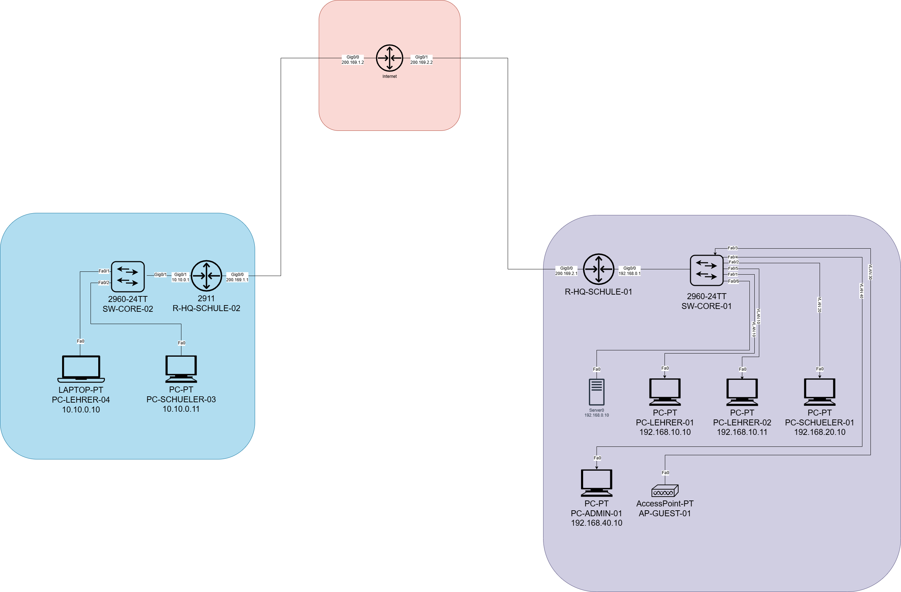

# Topologie

## Uebersicht

Das Projekt bildet ein Schulnetzwerk mit zwei Standorten ab. Der Hauptstandort ist rechts im Diagramm dargestellt und arbeitet mit mehreren logisch getrennten Netzen fuer Lehrpersonen, Schueler, Administration und WLAN/Gastzugang. Der zweite Standort ist links dargestellt und ist ueber ein WAN-/Internet-Segment mit dem Hauptstandort verbunden.

## Standort Hauptschule

Am Hauptstandort werden die internen Endgeraete ueber den Switch `SW-CORE-01` angebunden. Der Router `R-HQ-SCHULE-01` ist das zentrale Gateway des Standorts und verbindet das interne Netz mit dem WAN-/Internet-Segment.

Die Verbindung zwischen `R-HQ-SCHULE-01` und `SW-CORE-01` nutzt das interne Gateway `192.168.0.1`. Der Router ist ausserdem ueber `200.169.2.1` mit dem WAN verbunden. Am Switch sind mehrere Endgeraete und ein Access Point angeschlossen. Die eingezeichneten VLANs trennen die verschiedenen Benutzergruppen voneinander.

## Standort Aussenstelle

Die Aussenstelle verwendet den Switch `SW-CORE-02` und den Router `R-HQ-SCHULE-02`. Die internen Clients befinden sich im Netz `10.10.0.0/24`. Der Router stellt mit `10.10.0.1` das lokale Gateway bereit und ist ueber `200.169.1.1` mit dem WAN verbunden.

An `SW-CORE-02` sind ein Lehrer-Laptop und ein Schueler-PC angeschlossen. Die Aussenstelle ist damit als kleiner zweiter Standort aufgebaut, der ueber das WAN mit dem Hauptstandort kommunizieren kann.

## WAN-/Internet-Segment

Zwischen den beiden Routern befindet sich ein simuliertes Internet-Segment. Dieses Segment verbindet die beiden WAN-Netze:

| Verbindung | Lokales Interface | Gegenstelle | Zweck |
| --- | --- | --- | --- |
| Aussenstelle zu Internet | `R-HQ-SCHULE-02` mit `200.169.1.1` | Internet-Router `200.169.1.2` | WAN-Anbindung der Aussenstelle |
| Hauptstandort zu Internet | `R-HQ-SCHULE-01` mit `200.169.2.1` | Internet-Router `200.169.2.2` | WAN-Anbindung des Hauptstandorts |

## Kommunikationsprinzip

Die Clients kommunizieren lokal ueber ihren Switch und verwenden jeweils den Router als Default Gateway. Standortuebergreifender Verkehr wird ueber das WAN-/Internet-Segment geleitet. Fuer die sichere Verbindung zwischen den Standorten wird ein Site-to-Site-VPN eingesetzt, damit die internen Netze geschuetzt miteinander kommunizieren koennen.
