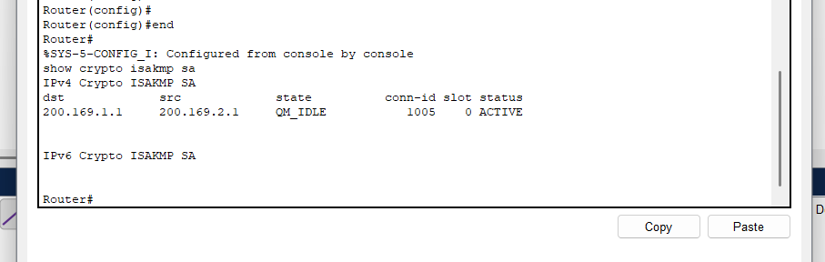
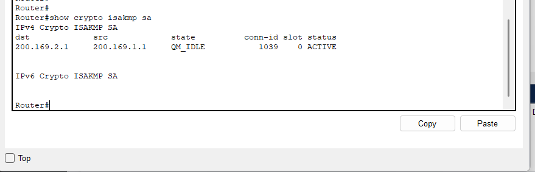
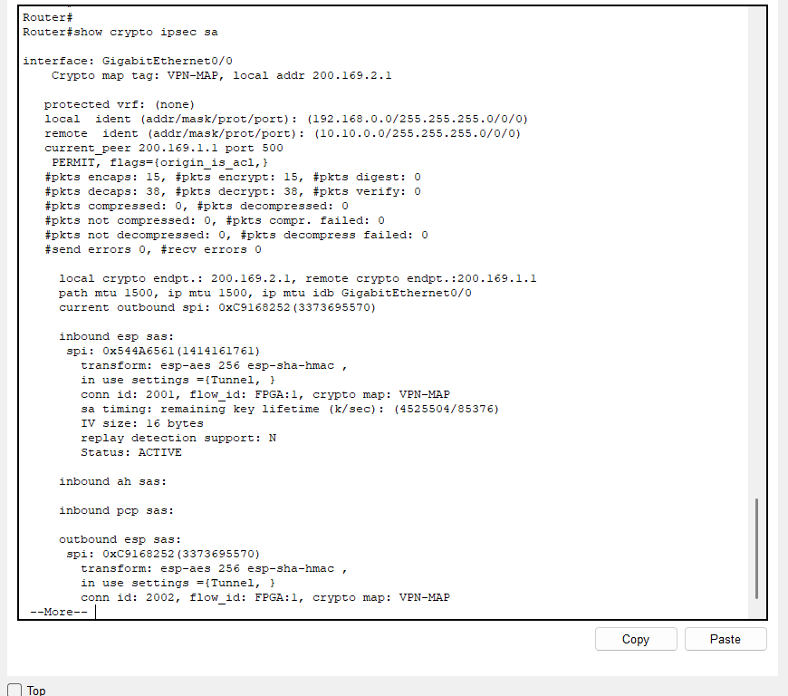
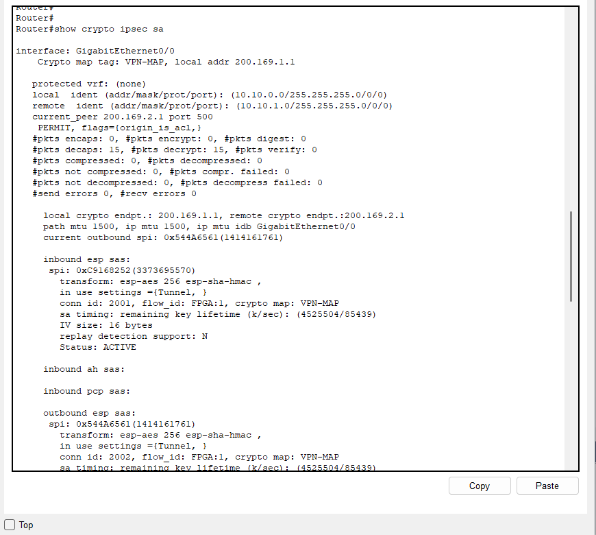
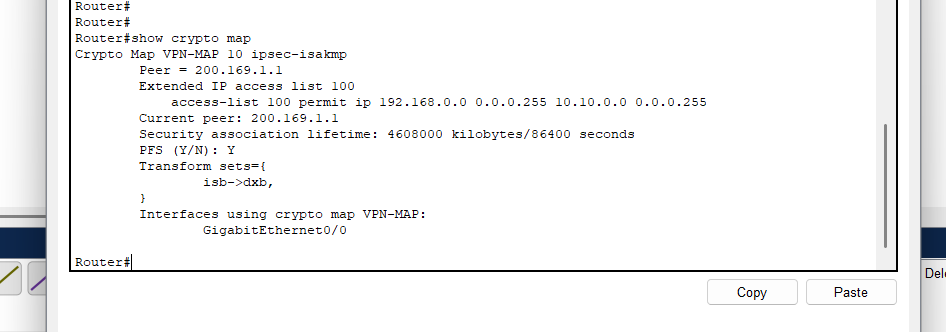
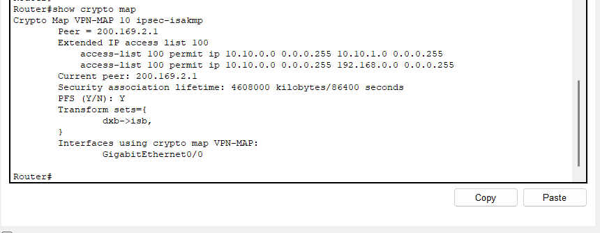
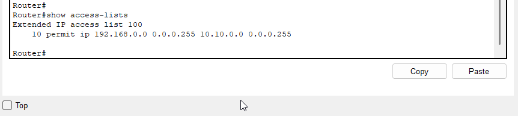
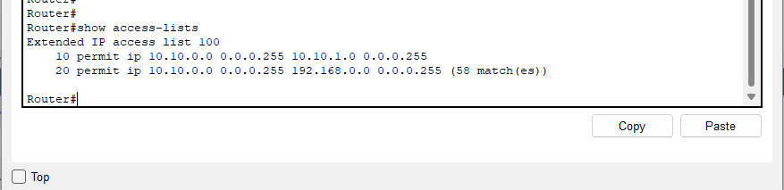

# IPsec Site-to-Site

## Aufbau

Das IPsec Site-to-Site-VPN verbindet zwei feste Router miteinander:

| Rolle | Router | WAN-IP | Lokales Netz |
| --- | --- | --- | --- |
| VPN-Endpunkt Hauptstandort | `R-HQ-SCHULE-01` | `200.169.2.1` | `192.168.0.0/24` |
| VPN-Endpunkt Aussenstelle | `R-HQ-SCHULE-02` | `200.169.1.1` | `10.10.0.0/24` |

Die Router bauen den Tunnel ueber das simulierte Internet auf. Die internen Netze bleiben privat adressiert und werden ueber den Tunnel miteinander verbunden.

## Phase 1: ISAKMP / IKE

In Phase 1 wird der sichere Steuerkanal zwischen den Routern aufgebaut. Dieser Schritt ist notwendig, damit die Router anschliessend IPsec-Parameter aushandeln koennen.

Die Screenshots zeigen auf beiden Routern eine aktive ISAKMP Security Association:

| Screenshot | Beobachtung | Bewertung |
| --- | --- | --- |
|  | Peer `200.169.1.1`, Status `ACTIVE` | Phase 1 ist auf `R-HQ-SCHULE-01` aufgebaut. |
|  | Peer `200.169.2.1`, Status `ACTIVE` | Phase 1 ist auf `R-HQ-SCHULE-02` aufgebaut. |

## Phase 2: IPsec

In Phase 2 werden die eigentlichen IPsec Security Associations fuer den Nutzdatenverkehr erstellt. Die Screenshots zeigen aktive ESP-SAs und Paketzaehler.

| Screenshot | Beobachtung | Bewertung |
| --- | --- | --- |
|  | Lokales Netz `192.168.0.0/24`, entferntes Netz `10.10.0.0/24`, aktive ESP-SAs, Paketzaehler fuer encrypt/decrypt | Phase 2 ist aktiv und verarbeitet Datenverkehr. |
|  | Lokales Netz `10.10.0.0/24`, entfernte Netze Richtung Hauptstandort, aktive ESP-SAs, Paketzaehler | Die Gegenseite verarbeitet ebenfalls IPsec-Traffic. |

## Crypto Map

Die Crypto Map verknuepft Peer, ACL, Transform-Set und Ausgangsinterface. Dadurch weiss der Router, welcher Verkehr verschluesselt werden muss und ueber welchen Peer der Tunnel aufgebaut wird.

| Router | Crypto Map | Peer | Interface | Screenshot |
| --- | --- | --- | --- | --- |
| `R-HQ-SCHULE-01` | `VPN-MAP` | `200.169.1.1` | `GigabitEthernet0/0` |  |
| `R-HQ-SCHULE-02` | `VPN-MAP` | `200.169.2.1` | `GigabitEthernet0/0` |  |

## Access Lists

Die ACLs definieren den interessanten Traffic fuer den VPN-Tunnel. Nur Verkehr, der zu diesen Regeln passt, wird vom Router fuer IPsec beruecksichtigt.

| Router | ACL-Aussage | Screenshot |
| --- | --- | --- |
| `R-HQ-SCHULE-01` | Erlaubt Verkehr von `192.168.0.0/24` nach `10.10.0.0/24`. |  |
| `R-HQ-SCHULE-02` | Erlaubt Verkehr zwischen der Aussenstelle und Netzen des Hauptstandorts; der Trefferzaehler zeigt, dass die Regel verwendet wurde. |  |

## Ergebnis

Die vorhandenen Nachweise zeigen, dass beide VPN-Phasen aktiv sind. Die Crypto Maps sind auf den WAN-Interfaces eingebunden, die ACLs definieren den passenden Traffic, und die IPsec-SAs zeigen verschluesselte sowie entschluesselte Pakete. Damit ist das Site-to-Site-VPN technisch erfolgreich aufgebaut.
