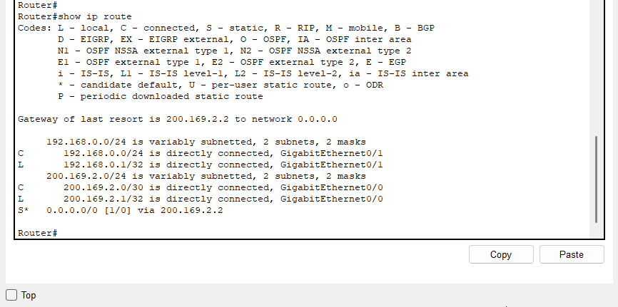
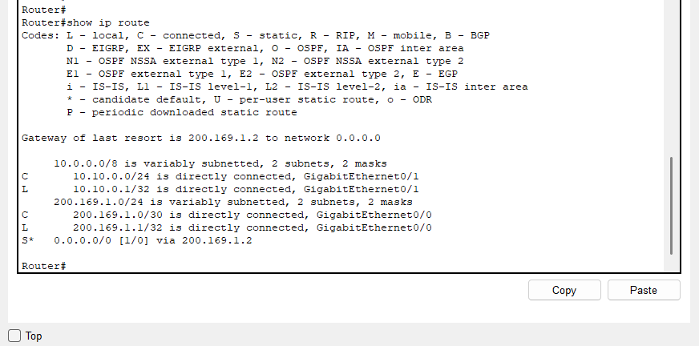

# Konfiguration

## Uebersicht

Dieses Dokument beschreibt die VPN-Konfiguration anhand der vorhandenen Nachweis-Screenshots. Es handelt sich um eine dokumentierte Zusammenfassung der erkennbaren Konfigurationsbestandteile und nicht um einen vollstaendigen Copy-Paste-Konfigurationsauszug.

## Beteiligte Router

| Router | Rolle | WAN-IP | LAN-Netz |
| --- | --- | --- | --- |
| `R-HQ-SCHULE-01` | VPN-Endpunkt Hauptstandort | `200.169.2.1` | `192.168.0.0/24` |
| `R-HQ-SCHULE-02` | VPN-Endpunkt Aussenstelle | `200.169.1.1` | `10.10.0.0/24` |

## Routing

Damit die Router ihre Gegenstelle erreichen, sind WAN-Routen bzw. Default Routen notwendig. Die Routing-Screenshots zeigen jeweils eine Default Route in Richtung Internet-Router.

| Router | Sichtbare Route | Nachweis |
| --- | --- | --- |
| `R-HQ-SCHULE-01` | Default Route `0.0.0.0/0` via `200.169.2.2` |  |
| `R-HQ-SCHULE-02` | Default Route `0.0.0.0/0` via `200.169.1.2` |  |

## ACL fuer VPN-Traffic

Die Extended Access List 100 legt fest, welcher Traffic verschluesselt werden soll.

Auf `R-HQ-SCHULE-01` ist folgende Regel sichtbar:

```text
permit ip 192.168.0.0 0.0.0.255 10.10.0.0 0.0.0.255
```

Auf `R-HQ-SCHULE-02` ist unter anderem folgende Gegenrichtung sichtbar:

```text
permit ip 10.10.0.0 0.0.0.255 192.168.0.0 0.0.0.255
```

Der Screenshot von `R-HQ-SCHULE-02` zeigt ausserdem Treffer auf der ACL-Regel. Das bestaetigt, dass Verkehr erzeugt wurde, der zur VPN-Regel passt.

## Crypto Map

Auf beiden Routern wird die Crypto Map `VPN-MAP` verwendet. Sie verbindet die ACL mit dem Peer, dem Transform-Set und dem WAN-Interface.

| Router | Crypto Map | Peer | ACL | Transform-Set | Interface |
| --- | --- | --- | --- | --- | --- |
| `R-HQ-SCHULE-01` | `VPN-MAP 10 ipsec-isakmp` | `200.169.1.1` | `100` | im Screenshot sichtbar, nicht vollstaendig ausgeschrieben | `GigabitEthernet0/0` |
| `R-HQ-SCHULE-02` | `VPN-MAP 10 ipsec-isakmp` | `200.169.2.1` | `100` | im Screenshot sichtbar, nicht vollstaendig ausgeschrieben | `GigabitEthernet0/0` |

Die Screenshots zeigen, dass die Crypto Map auf beiden Routern dem Interface `GigabitEthernet0/0` zugeordnet ist. Damit wird der VPN-Mechanismus auf dem WAN-Ausgang angewendet.

## ISAKMP / IKE

Die Ausgabe `show crypto isakmp sa` zeigt auf beiden Routern den Status `ACTIVE`. Dadurch ist nachgewiesen, dass die Router eine ISAKMP Security Association aufgebaut haben.

| Router | Peer | Status |
| --- | --- | --- |
| `R-HQ-SCHULE-01` | `200.169.1.1` | `ACTIVE` |
| `R-HQ-SCHULE-02` | `200.169.2.1` | `ACTIVE` |

## IPsec

Die Ausgabe `show crypto ipsec sa` zeigt die IPsec Security Associations. Auf beiden Routern sind ESP-SAs vorhanden und aktiv. Die Paketzaehler zeigen, dass Pakete verschluesselt und entschluesselt wurden.

| Router | Lokales Netz | Entferntes Netz | Beobachtung |
| --- | --- | --- | --- |
| `R-HQ-SCHULE-01` | `192.168.0.0/24` | `10.10.0.0/24` | Paketzaehler fuer encrypt/decrypt sichtbar |
| `R-HQ-SCHULE-02` | `10.10.0.0/24` | Richtung Hauptstandort | ESP-SAs und Paketzaehler sichtbar |

## Zusammenfassung

Die Konfiguration besteht aus diesen Bausteinen:

1. Routing ueber das WAN-/Internet-Segment
2. ACL 100 fuer den interessanten VPN-Traffic
3. ISAKMP/IKE fuer Phase 1
4. IPsec Transform-Set und Crypto Map fuer Phase 2
5. Anwendung der Crypto Map auf dem WAN-Interface

Die Screenshots belegen, dass diese Bausteine aktiv sind und der VPN-Tunnel funktioniert.
