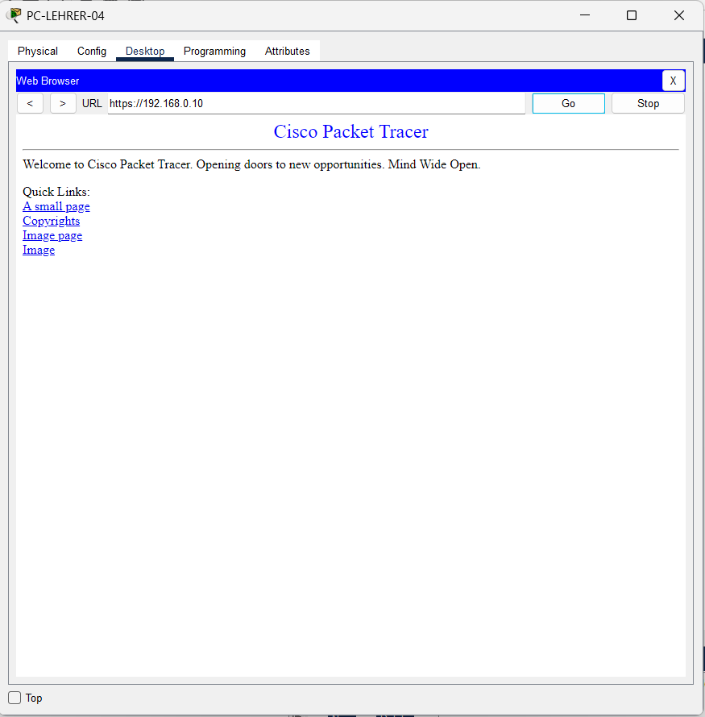

# Tests

## Ziel der Tests

Die Tests pruefen, ob der IPsec Site-to-Site-VPN-Tunnel zwischen Hauptstandort und Aussenstelle korrekt aufgebaut ist und ob tatsaechlich Datenverkehr zwischen den Standorten moeglich ist.

## Testuebersicht

| Nr. | Test | Erwartetes Ergebnis | Nachweis |
| --- | --- | --- | --- |
| 1 | Routing auf beiden Routern pruefen | Beide Router kennen ihr lokales Netz, das WAN-Netz und eine Default Route zur Internet-Gegenstelle. | `show ip route` |
| 2 | ACL fuer interessanten Traffic pruefen | Die ACL erlaubt den Verkehr zwischen den internen Standortnetzen. | `show access-lists` |
| 3 | ISAKMP-SA pruefen | Die ISAKMP Security Association ist aktiv. | `show crypto isakmp sa` |
| 4 | IPsec-SA pruefen | ESP-SAs sind aktiv und Paketzaehler zeigen verschluesselten Verkehr. | `show crypto ipsec sa` |
| 5 | Crypto Map pruefen | Peer, ACL, Transform-Set und WAN-Interface sind in der Crypto Map eingetragen. | `show crypto map` |
| 6 | Funktionalen Zugriff testen | Ein Client der Aussenstelle kann einen Dienst am Hauptstandort erreichen. | HTTPS-Test im Browser |

## Test 1: Routing

Auf `R-HQ-SCHULE-01` ist das lokale Netz `192.168.0.0/24`, das WAN-Netz `200.169.2.0/30` und eine Default Route via `200.169.2.2` sichtbar.

Nachweis: 

Auf `R-HQ-SCHULE-02` ist das lokale Netz `10.10.0.0/24`, das WAN-Netz `200.169.1.0/30` und eine Default Route via `200.169.1.2` sichtbar.

Nachweis: 

Bewertung: Routing ist fuer die WAN-Erreichbarkeit vorhanden.

## Test 2: Access Lists

Auf `R-HQ-SCHULE-01` erlaubt die ACL 100 den Verkehr von `192.168.0.0/24` nach `10.10.0.0/24`.

Nachweis: 

Auf `R-HQ-SCHULE-02` ist die Gegenrichtung sichtbar. Der Screenshot zeigt zudem Treffer auf der ACL, wodurch erkennbar ist, dass passender Traffic erzeugt wurde.

Nachweis: 

Bewertung: Der interessante Traffic fuer den VPN-Tunnel ist definiert und wird verwendet.

## Test 3: ISAKMP Security Association

Die Ausgabe `show crypto isakmp sa` zeigt auf beiden Routern den Status `ACTIVE`.

| Router | Peer | Status | Nachweis |
| --- | --- | --- | --- |
| `R-HQ-SCHULE-01` | `200.169.1.1` | `ACTIVE` |  |
| `R-HQ-SCHULE-02` | `200.169.2.1` | `ACTIVE` |  |

Bewertung: Phase 1 des VPNs wurde erfolgreich aufgebaut.

## Test 4: IPsec Security Association

Die Ausgabe `show crypto ipsec sa` zeigt aktive ESP-SAs. Auf den Screenshots sind Paketzaehler fuer verschluesselte und entschluesselte Pakete sichtbar.

| Router | Nachweis | Bewertung |
| --- | --- | --- |
| `R-HQ-SCHULE-01` |  | Phase 2 ist aktiv und verarbeitet Datenverkehr. |
| `R-HQ-SCHULE-02` |  | Die Gegenseite hat ebenfalls aktive IPsec-SAs. |

Bewertung: Der Tunnel ist nicht nur aufgebaut, sondern transportiert auch Daten.

## Test 5: Crypto Map

Die Crypto Map `VPN-MAP` ist auf beiden Routern vorhanden und dem Interface `GigabitEthernet0/0` zugeordnet.

| Router | Nachweis | Bewertung |
| --- | --- | --- |
| `R-HQ-SCHULE-01` |  | Crypto Map zeigt Peer, ACL und Interface. |
| `R-HQ-SCHULE-02` |  | Crypto Map ist auf der Gegenseite ebenfalls korrekt eingebunden. |

Bewertung: Die VPN-Parameter sind auf den WAN-Interfaces aktiv.

## Test 6: Funktionaler HTTPS-Zugriff

Der Screenshot zeigt den Webbrowser von `PC-LEHRER-04` mit erfolgreichem Zugriff auf `https://192.168.0.10`. Damit wird praktisch nachgewiesen, dass ein Client aus der Aussenstelle einen Dienst im Hauptstandort erreichen kann.

Nachweis: 

Bewertung: Der End-to-End-Test ist erfolgreich.

## Fazit

Alle relevanten VPN-Nachweise sind vorhanden. Routing, ACLs, Crypto Maps, ISAKMP-SA und IPsec-SA sind dokumentiert. Der HTTPS-Test bestaetigt die praktische Funktion der Verbindung zwischen den Standorten.
