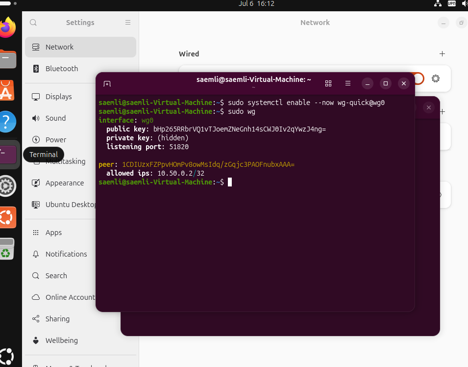

# Messwerte

## Ziel

In dieser Datei dokumentiere ich, welche Messwerte für die VPN-Überwachung relevant sind. Da Packet Tracer keine echten Grafana-Metriken liefert, unterscheide ich zwischen Packet-Tracer-Nachweisen und Messwerten aus einem möglichen WireGuard-/Grafana-Lab.

## WireGuard-Nachweis

Das WireGuard-VPN konnte auf der Ubuntu-VM gestartet werden. Der Befehl `sudo wg` zeigt:

- Interface `wg0`
- Listening Port `51820`
- einen konfigurierten Peer
- erlaubte Peer-IP `10.50.0.2/32`

Das zeigt, dass der VPN-Grundaufbau funktioniert. Die automatische Auswertung über Grafana wurde nicht mehr umgesetzt.

## Packet-Tracer-Messwerte

| Messpunkt | Methode | Beobachtung | Bewertung |
| --- | --- | --- | --- |
| VPN Phase 1 | `show crypto isakmp sa` | Security Association ist `ACTIVE`. | Tunnelaufbau erfolgreich |
| VPN Phase 2 | `show crypto ipsec sa` | ESP-SAs und Paketzähler sind sichtbar. | Datenverkehr wird über IPsec verarbeitet |
| Routing | `show ip route` | Default Routes und lokale Netze sind vorhanden. | Standortverbindung ist routingseitig vorbereitet |
| End-to-End-Test | HTTPS-Zugriff auf `192.168.0.10` | Webseite ist erreichbar. | VPN funktioniert praktisch |

Die zugehörigen Screenshots sind hier dokumentiert:

[VPN-Nachweise](../02_Projekt_Schulnetzwerk/assets/screenshots/README.md#vpn-nachweise)

## Mögliche Grafana-Messwerte

| Messwert | Beispielwert | Bedeutung |
| --- | --- | --- |
| VPN Peer Status | online | Der VPN-Peer ist erreichbar. |
| Last Handshake | unter 60 Sekunden | Der Tunnel wird aktiv verwendet. |
| Received Bytes | steigend | Über den Tunnel werden Daten empfangen. |
| Transmitted Bytes | steigend | Über den Tunnel werden Daten gesendet. |
| Ping-Latenz | 1-20 ms im lokalen Lab | Verbindung ist stabil und schnell. |
| Paketverlust | 0 % | Keine Paketverluste im Test. |

## Beispiel-Tabelle für eine Messung

| Zeitpunkt | Test | Wert | Ergebnis |
| --- | --- | --- | --- |
| Start | Ping VPN-Gegenstelle | 0 % Paketverlust | erfolgreich |
| Start | Last Handshake | unter 60 Sekunden | erfolgreich |
| Nach Traffic | RX/TX Bytes | steigend | erfolgreich |
| Nach Unterbruch | Peer Status | offline / kein Handshake | Fehler erkennbar |

## Bewertung

Für die Abgabe ist wichtig, dass die Messwerte nicht nur gesammelt, sondern interpretiert werden. Ein steigender IPsec- oder WireGuard-Traffic zeigt, dass der Tunnel tatsächlich verwendet wird. Ein fehlender Handshake oder nicht steigende Paketzähler wäre ein Hinweis auf ein Problem.
